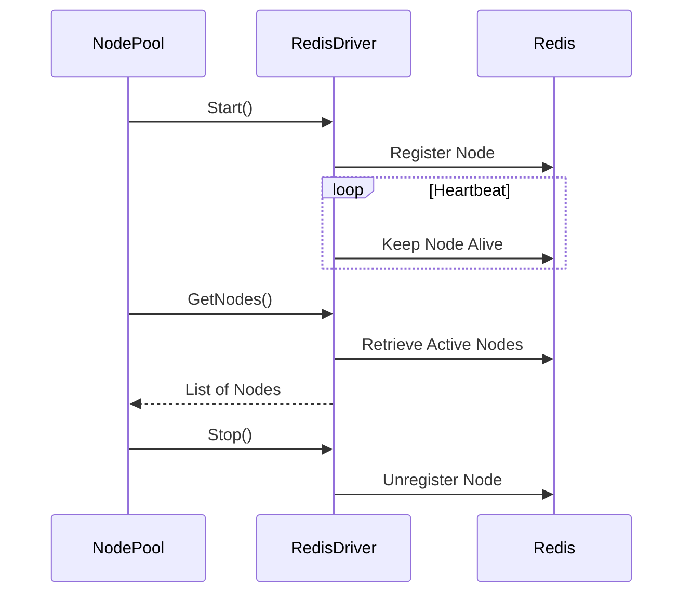

# NodePool Package

## Description

The `nodepool` package is designed to manage a pool of nodes within a distributed system, particularly focusing on maintaining the state and availability of these nodes for job execution. It interacts with Redis to register nodes, keep heartbeats, and retrieve the list of active nodes. The package ensures that jobs are only executed on nodes that are in a steady state, avoiding nodes that are upgrading or otherwise unavailable.


### Key Components

- **NodePool**: Manages the state of nodes (steady or upgrading) and decides if a node can run jobs based on its state.

- **RedisDriver**: Interacts with Redis to register nodes, keep heartbeats, and list nodes.

- **INodePool Interface**: Defines the contract for a node pool, including starting, stopping, and checking job availability.


### Interaction with Redis



The interaction with Redis primarily happens through the [RedisDriver] in the [driver] package. Here's a simplified flow:

1. **Initialization**: A [RedisDriver] is created and initialized with a Redis client, service name, and other configurations.

2. **Start**: On starting, the driver registers the service node in Redis, starts a heartbeat goroutine to keep the registration alive, and listens for cancellation.

3. **Heartbeat**: The heartbeat goroutine periodically re-registers the service node to keep it alive in Redis.

4. **Stop**: On stopping, the driver unregisters the service node from Redis and stops the heartbeat goroutine.

5. **GetNodes**: Retrieves the list of active nodes from Redis.

## Usage

This example demonstrates how to create a `NodePool`, start it, and check if a job is available to run on the current node.

```go
package main

import (
    "context"
    "fmt"
    "github.com/redis/go-redis/v9"
    "github.com/starton-io/go-dispatch/driver"
    "github.com/starton-io/go-dispatch/nodepool"
    "time"
)

func main() {
    // Initialize Redis client
    redisClient := redis.NewClient(&redis.Options{
        Addr: "localhost:6379",
    })

    // Create a RedisDriver
    drv := driver.NewRedisDriver(redisClient)

    // Create a NodePool
    np := nodepool.NewNodePool("myService", drv, 10*time.Second, 50, nil)

    // Start the NodePool
    if err := np.Start(context.Background()); err != nil {
        fmt.Printf("Error starting NodePool: %v\n", err)
        return
    }

    // Check if a job is available to run on this node
    available, err := np.CheckJobAvailable("job1")
    if err != nil {
        fmt.Printf("Error checking job availability: %v\n", err)
        return
    }

    if available {
        // Run job1
        fmt.Println("Job is available to run on this node.")
    }

    // Stop the NodePool
    if err := np.Stop(context.Background()); err != nil {
        fmt.Printf("Error stopping NodePool: %v\n", err)
    }
}
```